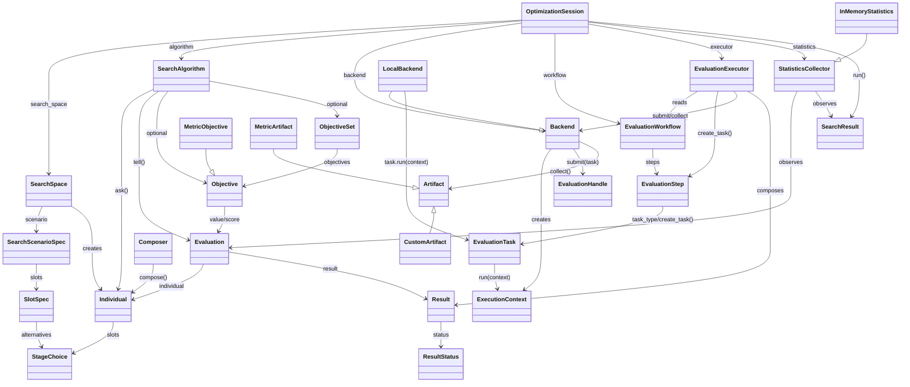

# Informe preliminar de arquitectura de GENIO

## Objetivo Del Framework

GENIO es un framework de optimizacion extensible. Su nucleo define contratos y estructura basica; las evaluaciones concretas, algoritmos concretos, compositores concretos y artefactos concretos se implementan como extensiones.

El framework separa estas responsabilidades:

- Definir el dominio de busqueda.
- Representar individuos, artefactos, evaluaciones y resultados.
- Proponer individuos mediante algoritmos de busqueda.
- Interpretar metricas mediante objetivos reutilizables.
- Declarar workflows de evaluacion con pasos dependientes.
- Convertir cada paso en una tarea ejecutable.
- Ejecutar tareas mediante backends.
- Registrar estadisticas de la sesion.

La clase que conecta estas piezas es `OptimizationSession`.

```text
OptimizationSession
├── SearchSpace
├── SearchAlgorithm
├── Objective / ObjectiveSet opcional en algoritmos concretos
├── EvaluationWorkflow
│   └── EvaluationStep[]
│       └── EvaluationTask
├── EvaluationExecutor
├── Backend
└── StatisticsCollector
```

## Flujo Del Framework

```text
OptimizationSession.run()
        ↓
StatisticsCollector.on_session_started(session)
        ↓
SearchAlgorithm.ask(session)
        ↓
Individual[]
        ↓
StatisticsCollector.on_batch_started(batch_index, individuals)
        ↓
OptimizationSession.evaluate(individuals)
        ↓
EvaluationExecutor.evaluate_many(individuals)
        ↓
Para cada Individual:
        ↓
EvaluationWorkflow.execution_order()
        ↓
Para cada EvaluationStep:
        ↓
EvaluationStep.create_task(individual, accumulated_artifacts)
        ↓
EvaluationTask concreta
        ↓
EvaluationExecutor valida isinstance(task, step.task_type)
        ↓
Backend.submit(task)
        ↓
Backend crea ExecutionContext(base_work_dir, run_id, backend_id, metadata)
        ↓
EvaluationTask.run(context)
        ↓
Artifact[]
        ↓
Backend devuelve EvaluationHandle
        ↓
Backend.collect(handle)
        ↓
EvaluationExecutor acumula artifacts internamente como step_id.artifact_name
        ↓
EvaluationExecutor extrae metricas desde MetricArtifact como step_id.metric_name
        ↓
Result.success(individual.id, metrics=accumulated_metrics)
        ↓
OptimizationSession crea Evaluation(individual, result, metadata={"batch_index": batch_index})
        ↓
SearchAlgorithm.tell(evaluations)
        ↓
SearchAlgorithm usa Objective/ObjectiveSet si su estrategia lo necesita
        ↓
StatisticsCollector.on_evaluation_completed(evaluation)
        ↓
StatisticsCollector.on_batch_completed(batch_index, evaluations)
        ↓
SearchAlgorithm.should_stop()
        ↓
SearchResult
        ↓
StatisticsCollector.on_session_completed(result)
```

## Reglas Arquitectonicas

- `EvaluationStep` define un paso logico, sus dependencias y el tipo de task que produce.
- `EvaluationStep.create_task(...)` no ejecuta herramientas externas ni toca infraestructura.
- `EvaluationTask` contiene la receta concreta de ejecucion de una unidad de trabajo.
- `EvaluationTask.run(context)` puede crear carpetas, invocar composers, usar plantillas, ejecutar comandos y devolver artefactos.
- Solo los artefactos que heredan de `MetricArtifact` se transforman en `Result.metrics`.
- `Result.metrics` contiene datos numericos sin semantica de optimizacion.
- `Objective` selecciona metricas concretas y declara si se maximizan o minimizan.
- Cada algoritmo concreto decide si no necesita objetivos, si necesita un objetivo escalar o si necesita un `ObjectiveSet` multiobjetivo.
- `Backend` proporciona infraestructura comun: workspace base, contexto, handles, estados, errores y recogida de artefactos.
- `Backend` no conoce logica especifica de dominio como Vitis, OpenCV, Git, plantillas o datasets.
- `ExecutionContext` contiene informacion de runtime/backend, no configuracion especifica del dominio.
- Configuraciones especificas como plantillas Vitis, rutas de dataset, comandos de toolchain o pesos de scoring deben vivir en la `EvaluationTask`, en artefactos de entrada o en objetos de configuracion propios.
- `evaluation_workflow` es obligatorio en `OptimizationSession`; no existe evaluacion por defecto independiente del dominio.

## Clases Implementadas

## 1. Orquestacion De Sesion

### `OptimizationSession`

Ubicacion: `src/genio/session/optimization.py`

Coordina el ciclo completo de optimizacion.

Constructor:

```python
OptimizationSession(
    search_space: SearchSpace,
    algorithm: SearchAlgorithm,
    backend: Backend,
    evaluation_workflow: EvaluationWorkflow,
    statistics: StatisticsCollector | None = None,
    id: str | None = None,
    metadata: dict[str, Any] | None = None,
)
```

Interfaz:

```python
run() -> SearchResult
evaluate(individuals: Sequence[Individual]) -> list[Evaluation]
```

Responsabilidades:

- Mantener referencias a `SearchSpace`, `SearchAlgorithm`, `Backend`, `EvaluationWorkflow`, `EvaluationExecutor` y `StatisticsCollector`.
- Ejecutar el ciclo `ask/evaluate/tell`.
- Delegar evaluaciones en `EvaluationExecutor`.
- Convertir `Result` en `Evaluation` y anotar `batch_index` en `Evaluation.metadata` durante `run()`.
- Notificar eventos a `StatisticsCollector`.
- Construir y devolver `SearchResult`.

## 2. Dominio De Busqueda

### `SearchSpace`

Ubicacion: `src/genio/search_space/space.py`

Define el dominio finito de busqueda y construye individuos validos.

Interfaz principal:

```python
SearchSpace(test_file, stages_definitions_path)
SearchSpace.from_scenario(scenario) -> SearchSpace
from_genotype(genotype, *, id=None, metadata=None) -> Individual
from_index(search_index, *, id=None, metadata=None) -> Individual
from_slots(slots, *, id=None, metadata=None) -> Individual
sample(...) -> Individual
sample_population(size, unique=True, ...) -> list[Individual]
genotype_to_index(genotype) -> int
index_to_genotype(search_index) -> tuple[int, ...]
to_genotype(individual) -> tuple[int, ...]
to_index(individual) -> int
```

Responsabilidades:

- Cargar escenarios desde JSON.
- Cargar definiciones de etapas.
- Construir `SearchScenarioSpec` y `SlotSpec`.
- Expandir alternativas de parametros.
- Crear individuos desde genotipos, indices o slots.
- Convertir entre genotipo, indice e individuo.
- Muestrear individuos y poblaciones.
- Validar estructura basica del espacio.
- Evaluar restricciones declaradas en definiciones de stages.

### `SearchScenarioSpec`

Ubicacion: `src/genio/search_space/spec.py`

Dataclass inmutable que describe un escenario de busqueda.

Campos:

```python
id: str
slots: tuple[SlotSpec, ...]
design_spaces: dict[str, dict[str, tuple[Any, ...]]]
metadata: dict[str, Any]
```

`design_spaces` agrupa decisiones globales por dominio. Estos dominios forman parte del mismo espacio de búsqueda que el pipeline, pero tienen consumidores distintos. Por ejemplo, un dominio `hls` puede ser usado por `HLSImagePipelineSynthesisEvaluationStep`, mientras que un dominio `system` puede ser usado por un futuro step de integración o evaluación de plataforma.

### `SlotSpec`

Ubicacion: `src/genio/search_space/spec.py`

Dataclass inmutable que describe las alternativas posibles en un slot.

Campos:

```python
index: int
alternatives: tuple[StageChoice, ...]
```

## 3. Modelo Core

### `StageChoice`

Ubicacion: `src/genio/core/individual.py`

Representa una eleccion concreta de etapa para un slot.

Campos:

```python
slot: int
stage: str
parameters: dict[str, Any]
wrapper_inputs: dict[str, Any]
```

### `Individual`

Ubicacion: `src/genio/core/individual.py`

Representa una solucion concreta dentro del espacio de busqueda.

Campos:

```python
id: str
scenario: str
slots: tuple[StageChoice, ...]
genotype: tuple[int, ...] | None
search_index: int | None
design: dict[str, Any]
metadata: dict[str, Any]
```

`design` mantiene separadas las decisiones globales por dominio:

```python
{
    "hls": {
        "pipeline_ii": 1,
    },
    "system": {
        "memory_size": 65536,
    },
}
```

El genotype representa la combinación completa de genes de pipeline y genes de diseño. Los steps deben consumir solo el dominio que les corresponde.

Interfaz:

```python
Individual.from_slots(...)
stage_sequence() -> tuple[str, ...]
parameters_by_slot() -> dict[int, dict[str, Any]]
```

### `Artifact`, `MetricArtifact` y `ArtifactError`

Ubicacion: `src/genio/core/artifact.py`

`Artifact` es una dataclass abstracta para salidas producidas por evaluaciones y consumidas por pasos posteriores.

Campos:

```python
name: str
producer: str
individual_id: str
objective: str | None
metadata: dict[str, Any]
```

Metodo abstracto:

```python
load() -> Sequence[Any]
```

Responsabilidades:

- Representar una salida material o logica.
- Proporcionar un nombre estable para acumulacion de artefactos.
- Servir como frontera entre steps.

`MetricArtifact` hereda de `Artifact` y marca artefactos que exponen metricas numericas normalizadas.

Interfaz adicional:

```python
metrics() -> Mapping[str, float]
```

Responsabilidades:

- Identificar artefactos que contienen metricas numericas.
- Permitir la composicion automatica de `Result.metrics`.
- Mantener separada la carga general del artefacto (`load`) de la extraccion semantica de metricas (`metrics`).

No debe:

- Decidir si una metrica se maximiza o minimiza.
- Comparar individuos.
- Calcular fitness global.

`ArtifactError` es la excepcion base para errores de artefactos.

### `Result` y `ResultStatus`

Ubicacion: `src/genio/core/result.py`

`Result` representa la salida normalizada de la evaluacion completa de un individuo.

Campos:

```python
individual_id: str
status: ResultStatus
metrics: dict[str, float]
error: str | None
```

Metodos:

```python
Result.success(individual_id, metrics=None)
Result.failed(individual_id, error, metrics=None)
```

`ResultStatus` define:

```python
SUCCESS = "success"
FAILED = "failed"
```

### `Evaluation`

Ubicacion: `src/genio/core/evaluation.py`

Conecta un individuo con su resultado.

Campos:

```python
individual: Individual
result: Result
metadata: dict[str, Any]
```

### `SearchResult`

Ubicacion: `src/genio/core/search_result.py`

Resultado final de una sesion.

Campos:

```python
session_id: str
evaluations: tuple[Evaluation, ...]
best_individuals: tuple[Individual, ...]
statistics: dict[str, Any]
```

## 4. Estrategia De Busqueda

### `SearchAlgorithm`

Ubicacion: `src/genio/algorithm/base.py`

Contrato abstracto para algoritmos de busqueda mediante el patron `ask/tell`.

Interfaz:

```python
ask(session: OptimizationSession) -> Sequence[Individual]
tell(evaluations: Sequence[Evaluation]) -> None
should_stop() -> bool
best_individuals() -> Sequence[Individual]
```

Responsabilidades:

- Proponer individuos.
- Recibir evaluaciones.
- Interpretar resultados, metricas y errores.
- Mantener estado interno de busqueda.
- Decidir cuando detenerse.
- Exponer mejores individuos.

## 5. Objetivos De Optimizacion

### `OptimizationDirection`

Ubicacion: `src/genio/objective/base.py`

Enum que declara la direccion de mejora de un objetivo.

```python
MAXIMIZE = "maximize"
MINIMIZE = "minimize"
```

### `Objective` y `ObjectiveError`

Ubicacion: `src/genio/objective/base.py`

Contrato abstracto para interpretar un valor numerico desde una `Evaluation`.

Interfaz:

```python
name: str
direction: OptimizationDirection
value(evaluation: Evaluation) -> float
score(evaluation: Evaluation) -> float
```

`score(...)` normaliza la direccion para algoritmos monoobjetivo: devuelve el valor original si se maximiza y el valor negado si se minimiza.

Responsabilidades:

- Seleccionar o calcular un valor objetivo desde `Result.metrics`.
- Declarar si el objetivo se maximiza o minimiza.
- Proporcionar un score escalar uniforme para algoritmos que lo necesiten.

No debe:

- Proponer individuos.
- Ejecutar evaluaciones.
- Modificar `Result.metrics`.

`ObjectiveError` se lanza cuando un objetivo no puede evaluarse, por ejemplo por metricas ausentes, valores no numericos, conjuntos vacios o nombres duplicados.

### `MetricObjective`

Ubicacion: `src/genio/objective/base.py`

Implementacion de `Objective` basada en una clave concreta de `Result.metrics`.

Constructor:

```python
MetricObjective(
    metric: str,
    optimization_direction: OptimizationDirection,
    id: str | None = None,
)
```

Reglas:

- `metric` es la clave que se lee desde `evaluation.result.metrics`.
- `id` permite dar un nombre estable distinto de la clave de metrica.
- Si `id` no se proporciona, `name` devuelve `metric`.
- Rechaza metricas ausentes, booleanos y valores no numericos.

Ejemplo:

```python
MetricObjective("functional.f1", OptimizationDirection.MAXIMIZE)
MetricObjective("hls.latency", OptimizationDirection.MINIMIZE, id="latency")
```

### `ObjectiveSet`

Ubicacion: `src/genio/objective/base.py`

Agrupa varios objetivos para algoritmos multiobjetivo o basados en Pareto.

Constructor:

```python
ObjectiveSet(objectives: tuple[Objective, ...])
```

Interfaz:

```python
values(evaluation: Evaluation) -> dict[str, float]
scores(evaluation: Evaluation) -> dict[str, float]
```

Reglas:

- Requiere al menos un objetivo.
- Rechaza nombres de objetivos duplicados.
- Preserva el orden de los objetivos para algoritmos que necesiten vectores.

### `dominates(...)`

Ubicacion: `src/genio/objective/base.py`

Utilidad para dominancia Pareto.

```python
dominates(left: Evaluation, right: Evaluation, objectives: ObjectiveSet) -> bool
```

Usa `objective.direction` para comparar cada componente. `left` domina a `right` si no es peor en ningun objetivo y es estrictamente mejor en al menos uno.

### Relacion Con Algoritmos

Los objetivos no son obligatorios en `OptimizationSession`. Cada algoritmo concreto declara lo que necesita:

```python
GridSearch()
RandomSearch()
HillClimbing(objective=MetricObjective("quality.f1", OptimizationDirection.MAXIMIZE))
NSGA2(objectives=ObjectiveSet((
    MetricObjective("quality.f1", OptimizationDirection.MAXIMIZE),
    MetricObjective("hls.latency", OptimizationDirection.MINIMIZE),
)))
```

Separacion de responsabilidades:

- `Result.metrics` contiene datos numericos crudos.
- `Objective` interpreta metricas y direccion.
- `SearchAlgorithm` usa objetivos solo si su estrategia lo requiere.

## 6. Workflow De Evaluacion

### `EvaluationWorkflow`

Ubicacion: `src/genio/evaluation/workflow.py`

Dataclass inmutable que representa el grafo declarativo de pasos de evaluacion.

Campos:

```python
steps: tuple[EvaluationStep, ...]
```

Interfaz:

```python
execution_order() -> tuple[EvaluationStep, ...]
ready_steps(completed: set[str]) -> tuple[EvaluationStep, ...]
```

Responsabilidades:

- Guardar pasos de evaluacion.
- Validar ids duplicados.
- Validar dependencias inexistentes.
- Detectar ciclos.
- Calcular orden de ejecucion compatible con dependencias.

### `EvaluationWorkflowError`

Ubicacion: `src/genio/evaluation/workflow.py`

Excepcion base para workflows invalidos.

Casos:

- ids duplicados;
- dependencias desconocidas;
- ciclos en el workflow.

### `EvaluationStep`

Ubicacion: `src/genio/evaluation/step.py`

Clase abstracta que representa un paso logico del workflow.

Interfaz:

```python
class EvaluationStep(ABC):
    id: str
    depends_on: tuple[str, ...] = ()
    task_type: type[EvaluationTask] = EvaluationTask

    @abstractmethod
    def create_task(
        self,
        individual: Individual,
        artifacts: Mapping[str, Artifact],
    ) -> EvaluationTask:
        ...
```

Responsabilidades:

- Declarar un identificador de paso.
- Declarar dependencias mediante `depends_on`.
- Declarar el tipo concreto de task que produce mediante `task_type`.
- Crear una `EvaluationTask` concreta para un individuo.
- Usar artefactos acumulados de pasos previos para construir tareas dependientes.

Restriccion:

- `create_task(...)` debe devolver una instancia de `step.task_type`.

### `EvaluationExecutor` y `EvaluationExecutionError`

Ubicacion: `src/genio/evaluation/executor.py`

Ejecuta un `EvaluationWorkflow` para uno o varios individuos usando un `Backend`.

Interfaz:

```python
EvaluationExecutor(workflow: EvaluationWorkflow, backend: Backend)
evaluate(individual: Individual) -> Result
evaluate_many(individuals: Sequence[Individual]) -> list[Result]
```

Responsabilidades:

- Recorrer `EvaluationWorkflow.execution_order()`.
- Crear tasks mediante `EvaluationStep.create_task(...)`.
- Validar coherencia `step.task_type` vs instancia creada.
- Enviar tasks al backend.
- Recoger artefactos desde el backend.
- Acumular artefactos internamente con claves `step_id.artifact_name` para alimentar steps dependientes.
- Extraer metricas desde `MetricArtifact` con claves `step_id.metric_name`.
- Componer un `Result.success(...)` por individuo con `metrics`, sin incluir artefactos no metricos en el `Result`.
- Rechazar claves duplicadas de artefactos o metricas.
- Rechazar metricas no numericas.

`EvaluationExecutionError` se lanza cuando un step declara un `task_type` pero crea una task incompatible, cuando se detectan claves duplicadas de artefactos o metricas, o cuando un `MetricArtifact` expone valores no numericos.

## 7. Tareas Ejecutables

### `ExecutionContext`

Ubicacion: `src/genio/evaluation/task.py`

Contexto de runtime creado por el backend y entregado a cada task.

Campos:

```python
base_work_dir: Path
run_id: str | None
backend_id: str | None
metadata: Mapping[str, Any]
```

Helpers implementados:

```python
resolve_path(path: str | Path) -> Path
task_dir(task: EvaluationTask, *parts: str | Path) -> Path
artifact_path(task: EvaluationTask, *parts: str | Path) -> Path
log_path(task: EvaluationTask, *parts: str | Path) -> Path
ensure_dir(path: str | Path) -> Path
ensure_parent(path: str | Path) -> Path
write_text(path: str | Path, content: str, *, encoding="utf-8") -> Path
read_text(path: str | Path, *, encoding="utf-8") -> str
write_bytes(path: str | Path, content: bytes) -> Path
read_bytes(path: str | Path) -> bytes
write_json(path: str | Path, data: Any, *, encoding="utf-8", indent=2) -> Path
read_json(path: str | Path, *, encoding="utf-8") -> Any
copy_file(source: str | Path, target: str | Path) -> Path
copy_tree(source: str | Path, target: str | Path, *, dirs_exist_ok=True) -> Path
write_log(task: EvaluationTask, name: str, content: str) -> Path
merged_env(env: Mapping[str, str] | None = None) -> dict[str, str]
run_command(command: Sequence[str], *, cwd=None, env=None, timeout=None, check=True) -> CommandResult
```

Responsabilidades:

- Exponer el directorio base de trabajo controlado por el backend.
- Exponer identificadores de runtime como `run_id` y `backend_id`.
- Transportar metadata de runtime por task.
- Mantener las tasks desacopladas del backend concreto.
- Proporcionar helpers genericos de filesystem, logs, entorno y ejecucion de comandos.

Regla:

- `ExecutionContext` no debe convertirse en configuracion de dominio.
- Informacion especifica como plantillas Vitis, datasets, toolchains o pesos de scoring debe vivir en tasks concretas, artefactos o configs propias.

### `EvaluationTask`

Ubicacion: `src/genio/evaluation/task.py`

Clase abstracta que representa una unidad ejecutable de evaluacion.

Campos:

```python
individual: Individual
id: str | None
step_id: str | None
metadata: Mapping[str, Any]
```

Propiedad:

```python
task_id: str
```

Metodo abstracto:

```python
run(context: ExecutionContext) -> list[Artifact]
```

Responsabilidades:

- Encapsular una unidad concreta de trabajo.
- Definir la receta real de ejecucion de un tipo de tarea.
- Decidir su organizacion interna de directorios a partir de `context.base_work_dir`.
- Invocar composers, plantillas o herramientas externas cuando su dominio lo requiera.
- Devolver artefactos producidos.

## 8. Infraestructura De Ejecucion

### `CommandResult`

Ubicacion: `src/genio/evaluation/task.py`

Resultado tipado devuelto por `ExecutionContext.run_command(...)`.

Campos:

```python
command: tuple[str, ...]
returncode: int
stdout: str
stderr: str
cwd: Path | None
```

Responsabilidades:

- Normalizar la salida de comandos externos.
- Facilitar logs, depuracion y generacion de artefactos desde stdout/stderr.

### `Backend`

Ubicacion: `src/genio/backend/base.py`

Contrato abstracto para mecanismos de ejecucion.

Interfaz:

```python
submit(task: EvaluationTask) -> EvaluationHandle
submit_batch(tasks: Sequence[EvaluationTask]) -> list[EvaluationHandle]
collect(handle: EvaluationHandle) -> list[Artifact]
status(handle: EvaluationHandle) -> EvaluationState
error(handle: EvaluationHandle) -> str | None
cancel(handle: EvaluationHandle) -> None
```

Responsabilidades:

- Recibir tareas ejecutables.
- Proporcionar infraestructura de ejecucion.
- Crear `ExecutionContext`.
- Devolver `EvaluationHandle`.
- Exponer artefactos mediante `collect`.
- Exponer estado mediante `status`.
- Exponer errores mediante `error`.
- Ofrecer cancelacion mediante `cancel`.

No debe:

- Implementar logica especifica de cada tipo de tarea.
- Saber como crear proyectos Vitis, clonar repositorios o generar pipelines concretos.

### `LocalBackend`

Ubicacion: `src/genio/backend/local.py`

Backend local y sincrono.

Constructor:

```python
LocalBackend(
    base_work_dir: str | Path | None = None,
    run_id: str | None = None,
    metadata: Mapping[str, Any] | None = None,
)
```

Responsabilidades:

- Configurar o autoconfigurar `base_work_dir`.
- Generar `run_id` si no se proporciona.
- Crear un `ExecutionContext` por task.
- Ejecutar `task.run(context)` en el proceso actual.
- Guardar artefactos en memoria.
- Guardar estados `RUNNING`, `DONE`, `FAILED` y `CANCELLED`.
- Registrar errores.

### `EvaluationHandle`

Ubicacion: `src/genio/backend/base.py`

Identifica una tarea enviada al backend.

Campos:

```python
id: str
task_id: str | None
backend_id: str | None
metadata: Mapping[str, Any]
payload: Any
```

### `EvaluationState`

Ubicacion: `src/genio/backend/base.py`

Estados normalizados de ejecucion:

```python
PENDING
RUNNING
DONE
FAILED
CANCELLED
```

## 9. Composicion

### `Composer`, `ComposerError` y `StageDefinitionNotFoundError`

Ubicacion: `src/genio/composer/base.py`

`Composer` es una clase abstracta para traducir un `Individual` a configuraciones, codigo, especificaciones o artefactos intermedios especificos de un dominio.

Interfaz:

```python
compose(individual: Individual) -> Any
active_choices(individual)
active_stage_definitions(individual)
should_skip(choice)
stage_definition(stage)
artifact_metadata(individual)
```

Responsabilidades:

- Recorrer etapas activas de un individuo.
- Cargar y consultar definiciones de stages.
- Proporcionar utilidades comunes para compositores concretos.
- Generar informacion que una `EvaluationTask` concreta puede usar durante `run(context)`.

Regla:

- Si un composer necesita plantillas, filesystem o materializacion, debe ejecutarse dentro de una `EvaluationTask.run(context)` o en una task especifica de composicion.
- El backend no debe conocer composers concretos.

`ComposerError` es la excepcion base del subsistema de composicion.

`StageDefinitionNotFoundError` se lanza cuando un individuo referencia una etapa desconocida.

## 10. Estadisticas

### `StatisticsCollector`

Ubicacion: `src/genio/statistics/base.py`

Clase base extensible para recolectores de estadisticas.

Interfaz:

```python
on_session_started(session: OptimizationSession) -> None
on_batch_started(batch_index: int, individuals: Sequence[Individual]) -> None
on_evaluation_completed(evaluation: Evaluation) -> None
on_batch_completed(batch_index: int, evaluations: Sequence[Evaluation]) -> None
on_session_completed(result: SearchResult) -> None
snapshot() -> dict[str, Any]
```

Los hooks de batch permiten registrar poblaciones o generaciones completas. El framework usa el termino `batch` porque no todos los algoritmos son generacionales; en algoritmos evolutivos un batch puede equivaler a una generacion.

### `InMemoryStatistics`

Ubicacion: `src/genio/statistics/base.py`

Implementacion simple de `StatisticsCollector`.

Snapshot actual:

```python
{"evaluations": len(self.evaluations), "batches": len(self.batches)}
```

## Diagrama De Relaciones

```text
OptimizationSession
├── search_space: SearchSpace
├── algorithm: SearchAlgorithm
│   └── objective/objectives: Objective | ObjectiveSet opcional
├── backend: Backend
├── evaluation_workflow: EvaluationWorkflow
│   └── steps: tuple[EvaluationStep, ...]
│       └── task_type: type[EvaluationTask]
├── evaluation_executor: EvaluationExecutor
│   ├── workflow: EvaluationWorkflow
│   └── backend: Backend
└── statistics: StatisticsCollector
```

## Diagrama Mermaid



## Ejemplo Ejecutable

El siguiente ejemplo usa solo clases implementadas y reproduce el flujo basico cubierto por los tests.

```python
from genio import (
    Artifact,
    Evaluation,
    EvaluationStep,
    EvaluationTask,
    EvaluationWorkflow,
    ExecutionContext,
    Individual,
    LocalBackend,
    MetricArtifact,
    OptimizationSession,
    SearchAlgorithm,
    SearchScenarioSpec,
    SearchSpace,
    SlotSpec,
    StageChoice,
)

class ScoreArtifact(MetricArtifact):
    def __init__(self, name: str, value, individual_id: str, producer: str = "example"):
        super().__init__(
            name=name,
            producer=producer,
            individual_id=individual_id,
            metadata={"value": value},
        )

    def load(self):
        return [self.metadata["value"]]

    def metrics(self):
        return {"score": self.metadata["value"]}

class ScoreTask(EvaluationTask):
    def run(self, context: ExecutionContext) -> list[Artifact]:
        score = self.individual.search_index or 0
        return [ScoreArtifact("score", score, self.individual.id)]

class ScoreStep(EvaluationStep):
    id = "score"
    task_type = ScoreTask

    def create_task(self, individual: Individual, artifacts):
        return ScoreTask(individual=individual, step_id=self.id)

class FirstIndividualAlgorithm(SearchAlgorithm):
    def __init__(self) -> None:
        self._evaluations: list[Evaluation] = []

    def ask(self, session: OptimizationSession):
        return [session.search_space.from_index(0, id="individual_001")]

    def tell(self, evaluations):
        self._evaluations.extend(evaluations)

    def should_stop(self) -> bool:
        return bool(self._evaluations)

    def best_individuals(self):
        if not self._evaluations:
            return ()
        return [self._evaluations[0].individual]

search_space = SearchSpace.from_scenario(
    SearchScenarioSpec(
        id="one_slot_space",
        slots=(
            SlotSpec(
                index=0,
                alternatives=(StageChoice(slot=0, stage="threshold"),),
            ),
        ),
    )
)

session = OptimizationSession(
    id="example_session",
    search_space=search_space,
    algorithm=FirstIndividualAlgorithm(),
    backend=LocalBackend(),
    evaluation_workflow=EvaluationWorkflow((ScoreStep(),)),
)

result = session.run()
score = result.evaluations[0].result.metrics["score.score"]
```

## Ejemplo De `MetricArtifact`

Este ejemplo usa la clase abstracta real `MetricArtifact` y una implementacion concreta equivalente a la usada en tests.

```python
from dataclasses import dataclass
from typing import Any, Mapping, Sequence
from genio import MetricArtifact

@dataclass(frozen=True, slots=True)
class ScoreArtifact(MetricArtifact):
    values: Mapping[str, float]

    def load(self) -> Sequence[Any]:
        return [dict(self.values)]

    def metrics(self) -> Mapping[str, float]:
        return self.values

artifact = ScoreArtifact(
    name="scores",
    producer="ScoreTask",
    individual_id="individual_001",
    objective="quality",
    values={"f1": 0.9, "latency": 12.0},
)

metrics = artifact.metrics()
```

## Ejemplo De Helpers De `ExecutionContext`

Este ejemplo usa helpers ya implementados para rutas, escritura de ficheros y comandos. El comando usa el interprete de Python para mantenerlo portable.

```python
import sys
from pathlib import Path
from genio import ExecutionContext, EvaluationTask, Individual, StageChoice

class HelperTask(EvaluationTask):
    def run(self, context: ExecutionContext):
        task_dir = context.ensure_dir(context.task_dir(self))
        config_path = context.write_json(task_dir / "config.json", {"ok": True})
        log_path = context.write_log(self, "task.log", "started")
        result = context.run_command(
            [sys.executable, "-c", "print('hello')"],
            cwd=task_dir,
        )
        return []

individual = Individual.from_slots(
    id="individual_001",
    scenario="helpers_space",
    slots=[StageChoice(slot=0, stage="nop")],
)

context = ExecutionContext(base_work_dir=Path("/tmp/genio-example"))
task = HelperTask(individual=individual, step_id="helpers")
artifacts = task.run(context)
```

## Clases Eliminadas En El Refactor

### `Candidate`

Fue eliminado para evitar duplicidad con `Individual`.

### `Evaluator`

Fue reemplazado primero por una fachada intermedia y posteriormente eliminado. La ruta principal de sesion usa `EvaluationExecutor`.

### `Runner`

Fue eliminado como abstraccion publica.

Modelo actual:

```text
LocalBackend -> EvaluationTask.run(ExecutionContext) -> list[Artifact]
```

### `SearchEngine`

Fue eliminado para evitar una segunda ruta de evaluacion paralela a `EvaluationExecutor`.

### `CallableEvaluationTask`

Fue eliminado porque era un adaptador de compatibilidad basado en callables. Las evaluaciones deben definirse mediante subclases concretas de `EvaluationTask`.

### `DefaultEvaluationStep`

Fue eliminado porque no existe una evaluacion por defecto independiente del dominio. Cada sesion debe proporcionar un `EvaluationWorkflow` explicito.

## Puntos Pendientes

- Definir si se necesitan helpers adicionales de `ExecutionContext` para casos no cubiertos por rutas, ficheros, JSON, copias, logs, entorno y comandos.
- Definir objetivos/fitness sobre las claves disponibles en `Result.metrics`.
- Definir politica de errores: convertir fallos de tasks en `Result.failed` o propagar excepciones.
- Separar implementaciones concretas de algoritmos en modulos como `algorithm/random.py`, `algorithm/grid.py` o adaptadores externos.
- Enriquecer `StatisticsCollector` con tiempos, historico de metricas, mejores individuos y errores.
- Definir persistencia de tasks, artefactos, resultados y sesiones.
